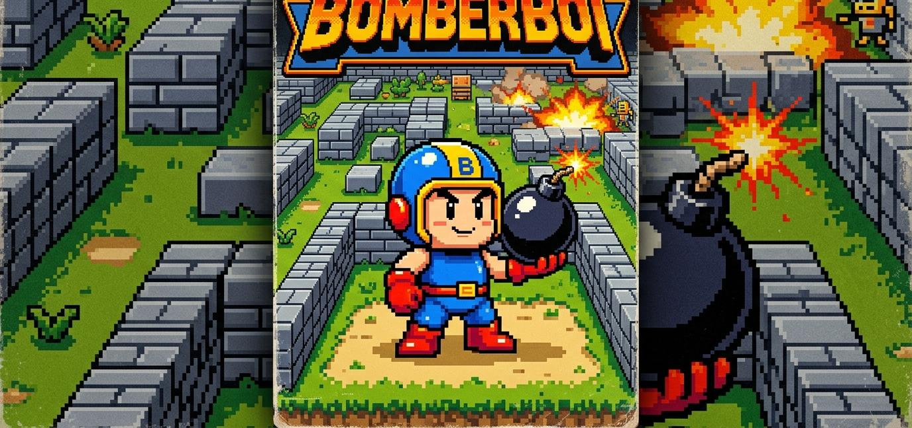

# bomberboi v 2.0

version update:
- massive graphics and UI overhaul
- powerups, new levels, and smarter enemies added

  
  <h3><a href="https://tunasafa.github.io/bomberboi/">🎮 CLICK THE BANNER TO PLAY BOMBERBOI 🎮</a></h3>

or download the files and open the index file in your own pc browser

visuals:

room for improvement for upcoming versions:

- ~~new levels , new maps, new enemies~~ (Added!)
- ~~powerups for the player~~ (Added!)
- ~~smarter and more agressive enemies~~ (Added!)
- ~~graphics improvements~~ (Complete Overhaul!)
- mobile version

+ ~~game sounds~~ (Added!)
